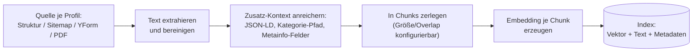
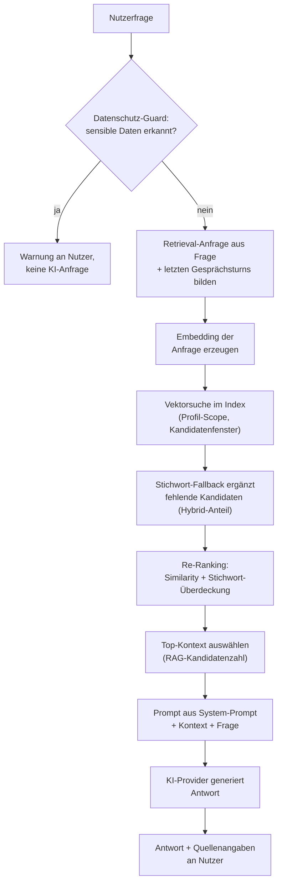

# AI Chat & Search für REDAXO

Ein FriendsOfREDAXO-AddOn für KI-gestützte Suche und Chat: Inhalte aus Artikeln, Sitemaps, Struktur-Bereichen, YForm-Tabellen, PDFs/Medienpool-Dateien und weiteren Quellen per Extension Point werden je Profil indexiert, per Vektorsuche durchsucht und wahlweise per KI zu einer Antwort verarbeitet. Mehrere Profile erlauben unterschiedliche Wissensstände, Zielgruppen, Prompts und Optiken nebeneinander – von einem einzelnen Standard-Profil bis zu mehreren parallel laufenden, vollständig voneinander isolierten Bereichen.

> Vormals `klxmchat`/„KLXM Chat & Search" – ab Version 1.0.0 als `ai_chat` neu aufgesetzt (neuer Addon-Key, neuer Namespace `FriendsOfRedaxo\AiChat`, keine automatische Migration alter Installationen).

## Einleitung

Kern des Addons ist eine klassische RAG-Pipeline (Retrieval-Augmented Generation): Inhalte werden in Textabschnitte zerlegt, als Vektoren gespeichert und bei einer Anfrage nach semantischer Ähnlichkeit durchsucht – nicht nach exakten Wörtern. Darüber liegen zwei nutzbare Oberflächen: eine reine Trefferliste (Suche) und eine KI-generierte Antwort mit Quellenangaben (Chat). Beide teilen sich denselben Index und laufen wahlweise kombiniert oder unabhängig voneinander.

Darüber hinaus bringt das Addon ein Profil-System mit, über das sich mehrere thematisch, sprachlich oder nach Zielgruppe getrennte „Instanzen" des Chats parallel betreiben lassen – inklusive eigenem Wissensausschnitt, eigenem Prompt, eigener Anrede, eigener Antwortsprache und eigenem Erscheinungsbild je Profil. Ein einzelnes Standard-Profil reicht für die meisten Installationen völlig aus; wer mehr braucht, kann beliebig viele weitere anlegen.

## Ablauf im Überblick

Zwei getrennte Abläufe: **Indexierung** passiert einmalig bzw. bei jeder Neuindizierung, **Abruf & Antwort** bei jeder einzelnen Chat-/Suchanfrage.





Die reine **Suche** (ohne Chat-Antwort) überspringt die Prompt-/KI-Schritte und zeigt stattdessen direkt die gefundenen Treffer als Liste; eine optionale KI-Zusammenstellung über mehrere Bereiche hinweg läuft dort separat nachgeladen (siehe Einzelfeature „Suche" unten).

## Features

- Frontend-Suche und Frontend-Chat für Website-Besucher
- Mehrere, vollständig voneinander isolierte Profile mit eigenem Wissens-Scope, eigener Zielgruppe (Rolle/Domain/Sprache), eigenem Prompt, eigener Anrede/Antwortsprache und eigenem Theme
- Google Gemini, Cloudflare Workers AI, OpenAI-kompatible Endpunkte sowie optional das FriendsOfREDAXO-Addon `ai_platform` als gemeinsame Provider-Verwaltung
- Natives Vektor-Retrieval auf MariaDB 11.7+/11.8+, mit automatischem Fallback auf PHP-seitige Berechnung auf älteren Versionen oder MySQL
- Indexierung je Profil aus Sitemaps und Struktur-Bereichen (jeweils mehrere benannte, gleichzeitig kombinierbare Gruppen), YForm-Tabellen, PDFs/Medienpool-Dateien sowie weiteren Content-Providern per Extension Point – Wissen lässt sich bei Bedarf gezielt mit anderen Profilen teilen
- Missbrauchsschutz: Erkennung von Prompt-Injection/Jailbreak-Versuchen, freundliche Gesprächsbeendigung bei wiederholten Angriffen, optionale Meldung an das Intrusion-Prevention-Addon `upkeep`
- Übersetzbare Widget-Oberfläche (JSON-Sprachdateien, unabhängig von der Sprache der KI-Antworten)
- FAQ-Vorcaching für wiederkehrende Fragen, je Profil konfigurierbar
- Statistik zu Suchbegriffen, häufigen Fragen und Treffer-losen Anfragen, je Profil filterbar

## Einzelfeatures

### Profile

Ein Profil bestimmt drei Dinge gleichzeitig: **wer** den Chat/die Suche sieht, **was** er weiß und **wie** er antwortet. Profile sind ausschließlich ein Frontend-Konzept (siehe „Sicherheit und Zugriff" weiter unten).

- **Sichtbarkeit**: Rolle (Besucher, angemeldete Redakteure, Admins) und Zielgruppe (alle Domains/Sprachen, bestimmte Domains, bestimmte Sprachen, oder beides). Passen mehrere Profile auf dieselbe Anfrage, gewinnt die höhere Priorität.
- **Wissens-Scope**: Jedes Profil ist vollständig isoliert und durchsucht ausschließlich die Quellen, die es selbst gewählt hat: benannte Sitemap-Gruppen, benannte Struktur-Bereiche (Kategorie-Teilbäume der REDAXO-Struktur), YForm-Tabellen sowie PDFs/Medienpool-Dateien oder -Kategorien – beliebig miteinander kombinierbar. Der einzige Weg, Wissen zwischen zwei Profilen zu teilen, ist das explizite Feld „Wissen teilen mit Profil(en)" (`include_profile_ids`): zusätzlich zu den eigenen Quellen werden dann auch die Quellen der dort ausgewählten anderen Profile durchsucht.
- **Prompt, Anrede, Antwortsprache**: Ein eigener System-Prompt ersetzt bei Bedarf die globale Einstellung. Anrede (Du/Sie/neutral/automatisch per Personalisierungsdialog) und Antwortsprache lassen sich je Profil festlegen – Letztere unabhängig von der Oberflächen-Sprache des Widgets, leer = weiterhin Deutsch.
- **Theme**: ein Profil wählt ein zentral unter „AI Chat → Themes" gepflegtes Theme aus einem Dropdown (siehe Einzelfeature „Zentrale Theme-Verwaltung" unten) – leer = globales Standard-Theme. Die Widget-Position (unten rechts/links) bleibt davon unabhängig und ein eigenes Profil-Override.
- **Folgefragen/Quellenanzeige**: „Vorgeschlagene Folgefragen anzeigen" und „Quellen/Links in Antworten anzeigen" sind eigene Einstellungen je Profil – jedes Profil legt sie eigenständig fest, z. B. um bei einem reinen FAQ-Profil Folgefragen abzuschalten, ohne andere Profile zu beeinflussen.
- **FAQ-Vorcaching**: ebenfalls eine reine Profil-Einstellung, siehe Einzelfeature „FAQ-Vorcaching" unten.
- **Live-Vorschau**: Jede Profil-Seite zeigt ein echtes, an genau dieses Profil gebundenes Test-Widget mit dem aktuell gespeicherten Stand (Theme, Prompt, Begrüßung, …).

Ein Standard-Profil (alle Domains/Sprachen, alle Rollen) wird bei der Installation automatisch angelegt, sodass Chat und Suche ohne weitere Konfiguration sofort funktionieren.

### Zentrale Theme-Verwaltung

Statt Farben/Avatar/Eckenradius in jedem Profil einzeln zu pflegen, verwaltet „AI Chat → Themes" beliebig viele benannte, wiederverwendbare Themes an einer Stelle – ein Profil wählt nur noch eines davon aus, mehrere Profile können sich dasselbe Theme teilen, eine Änderung dort wirkt automatisch überall, wo es zugewiesen ist. Ohne Auswahl gilt das als „Standard" markierte, globale Theme.

- **Alpha-fähiger Colorpicker** (Hex-Eingabe, Farbfläche/Regler, Voreinstellungen) statt des nativen, transparenzlosen `<input type="color">` – Farben können jetzt auch teiltransparent sein (z. B. `#007bffcc`).
- **Eigene Textfarben für Bot- und Nutzer-Sprechblase**, unabhängig von der Kopfzeilen-Textfarbe – wichtig z. B. bei einer hellen Akzentfarbe (weißer Text darauf ist kaum lesbar) oder einem bewusst dunkel gehaltenen Theme.
- **Eingabefeld-Theming** (Hintergrund/Textfarbe/Rahmen), damit das Eingabefeld bei einem dunklen Theme nicht wie ein vergessenes, weiß gebliebenes UI-Element wirkt.
- **Live-Vorschau mit der echten Chat-Komponente**: die Vorschau bettet dieselbe `<ai-chat>`-Webcomponente ein, die auch im echten Betrieb läuft (nicht nachgebaut) – sieht dadurch exakt wie der spätere Chat aus und bleibt automatisch korrekt, auch wenn sich das Widget-Design künftig ändert.
- Die Widget-Position (unten rechts/links) ist bewusst **kein** Theme-Bestandteil, sondern bleibt ein eigenes, unabhängiges Override – global und je Profil.

### Suche

- Vektorbasierte semantische Suche über den Index, nicht auf exakte Wörter angewiesen
- Live-Suche mit kurzer Verzögerung beim Tippen, plus expliziter Suchen-Button für alle, die lieber gezielt auslösen
- Facetten-Filterung nach Quellentyp (Artikel, Sitemap-Seite, PDF, YForm-Datensatz, …) sowie nach benannten Sitemap-/Struktur-Gruppen (siehe unten)
- Erkennung von Fragen auch ohne Fragezeichen – bei erkannter Frage ergänzt eine KI-Antwort automatisch die Trefferliste, ohne die Trefferliste selbst zu verzögern
- Optionale, separat nachgeladene KI-Zusammenstellung über mehrere Bereiche hinweg, wenn Treffer aus mehreren benannten Sitemap-/Struktur-Gruppen stammen (deaktiviert per Standard, da ein zusätzlicher KI-Aufruf pro Suche)
- Datenschutz-Guard für sensible Eingaben (E-Mail, IBAN, Passwörter/PINs) sowie Schutz gegen Prompt-Injection- und Code-Injection-Versuche

### Chat

- Frontend-Chat für Besucher, mit eigenem, je Profil konfigurierbarem System-Prompt
- Automatisch als Bubble eingebunden oder wahlweise „ohne Bubble" an einem selbst platzierten Trigger-Element (Klasse/ID `aichat`) – klappt automatisch nach oben oder unten auf, je nach verfügbarem Platz
- Personalisierung (Du/Sie erfragen, optional mit Namen) und konfigurierbare Anrede
- Reset-Countdown mit sichtbarer Anzeige, optionales Kopieren/Herunterladen des Verlaufs
- SSE-Streaming für laufend eintreffende Antworten statt einer Wartezeit bis zum kompletten Text (siehe Server-Voraussetzungen weiter unten) – rein global, gilt gleichermaßen für alle Profile
- Quellenangaben unter der Antwort, mit Schwellenwerten gegen offensichtlich unpassende Links

### Indexierung

- Artikel-/Content-Indexierung für REDAXO (über Struktur-Bereiche), Sitemaps, YForm-Tabellen, PDFs/Medienpool sowie weitere Provider per Extension Point – Quellen werden ausschließlich je Profil gewählt und beliebig kombiniert
- Zwei Indexierungs-Methoden für Artikel: **Intern** (Standard, schnell, nutzt REDAXOs eigenen Renderer) oder **HTTP Crawler** (ruft die Artikel-URL wie ein Browser ab – sinnvoll, wenn Cache/Proxy/Ausgabelogik den finalen Frontend-Inhalt gegenüber dem internen Renderer verändern). Für den HTTP Crawler lassen sich ein CSS-Hauptselektor (Standard `body`, mehrere durch Komma möglich) sowie Ausschluss-Selektoren (z. B. `nav, footer, .cookie-banner`) konfigurieren, um wiederkehrende Navigations-/Footer-Texte draußen zu halten.
- Inkrementelle und vollständige Neuindizierung, wahlweise als Hintergrund-Job (Button „Im Hintergrund indexieren" oder `php redaxo/bin/console ai_chat:reindex`) – läuft serverseitig weiter, auch wenn der Browser-Tab geschlossen wird
- Chunking mit konfigurierbarer Größe (Standard 1000 Zeichen) und Überlappung (Standard 200 Zeichen), damit zusammengehörige Informationen nicht mitten durchgeschnitten werden
- RAG-Kandidatenfenster (`rag_candidate_limit`): bestimmt, wie viele Chunks vor dem Ähnlichkeitsvergleich geladen werden. Bei nativem Vektor-Retrieval (siehe unten) unkritisch, da die Datenbank ohnehin über den gesamten gefilterten Index sortiert; ohne natives Vektor-Retrieval sollte der Wert größer als die Gesamtzahl indexierter Chunks sein, sonst bleiben manche Inhalte beim Vergleich unberücksichtigt. Ein Button „RAG-Kandidatenfenster automatisch optimieren" schlägt einen passenden Wert vor.
- Optionale Embedding-Kontext-Hinweise und Fokus-Regeln (Format `Label|Begriff1|Begriff2`), um bestimmten Themen zusätzliches Gewicht zu geben, sowie automatische Auswertung von JSON-LD (`Person`, `Organization`, `ContactPoint`, `LocalBusiness`, `BreadcrumbList`, `FAQPage`, Öffnungszeiten) als strukturierte, eindeutige Faktenquelle – hilfreich, damit der Chat Zuständigkeiten/Ansprechpartner nicht versehentlich verwechselt oder kombiniert
- **Kategorie-Pfad als Embedding-Kontext**: jeder Textabschnitt bekommt vor dem Embedding zusätzlich seine Einordnung mitgegeben – bei Struktur-Inhalten die echte REDAXO-Kategorie-Hierarchie (z. B. „Agentur > Leistungen > Webentwicklung"), bei Sitemap-/YForm-/Provider-Inhalten ohne REDAXO-Kategorie ersatzweise die aus der URL abgeleitete Ordnerstruktur. Abschaltbar, Standard: an.
- **Konfigurierbare Metainfo-Felder**: eigene Metainfo-Spalten (z. B. eine „Meta-Keywords"-Spalte) lassen sich als zusätzlicher Kontext-Hinweis vor dem Embedding jedes Artikels einbeziehen – Feldnamen sind pro Installation frei vergeben, deshalb konfigurierbar statt fest verdrahtet.
- **Re-Ranking**: die Top-Kandidaten der Ähnlichkeitssuche (Standard: 20) werden vor der finalen Auswahl zusätzlich nach Stichwort-Überdeckung mit der Frage neu sortiert – korrigiert Fälle, in denen die reine Vektor-Ähnlichkeit einen thematisch zufälligen, aber embedding-technisch naheliegenden Treffer vor eine tatsächlich passendere Seite stellt. Ohne zusätzlichen KI-Aufruf, keine spürbare Verzögerung.
- Cache-Warmup für häufig gestellte Fragen (siehe FAQ-Vorcaching), je Profil mit eigener Fragenliste

### Natives Vektor-Retrieval

Ab MariaDB 11.7 (Preview) bzw. 11.8 (GA/LTS) nutzt das Addon automatisch die native `VECTOR`-Spalte samt `VECTOR INDEX` und `VEC_DISTANCE_COSINE()` – die Datenbank kombiniert dabei Ähnlichkeitssuche und SQL-Filterung (Profil, Sprache, aktuelle Seite) in einer einzigen, indexgestützten Abfrage, deutlich schneller als der PHP-seitige Vergleich bei größeren Indizes. Erkennung läuft automatisch per Versions-Check (mit „Neu prüfen"-Button, falls die Datenbank nach der Installation aktualisiert wird); auf älteren MariaDB-Versionen oder MySQL bleibt die PHP-Brute-Force-Berechnung als dauerhafter, gleichwertiger Fallback erhalten – ein öffentliches Addon muss schließlich auch dort funktionieren.

### Benannte Sitemap- und Struktur-Bereiche

Zusätzliche Sitemaps und Struktur-Bereiche (Kategorie-Teilbäume der REDAXO-Struktur) lassen sich je Profil jeweils in mehrere benannte Gruppen aufteilen statt in einer einzigen Liste (z. B. „Allgemein" und „News" mit jeweils eigenen URLs, oder mehrere benannte Kategorie-Bereiche). Beide Quellenarten sind symmetrisch aufgebaut und beliebig kombinierbar, auch untereinander. Jede Gruppe (egal ob Sitemap oder Struktur) kann zusätzlich:

- eine kurze **Beschreibung** bekommen, die der KI als Zusatzkontext mitgeteilt wird und ihr hilft, den Bereich thematisch einzuordnen,
- als **aktuell/zeitkritisch** markiert werden (z. B. eine News-Gruppe) – Fragen mit Signalwörtern wie „aktuell", „neu" oder „zuletzt" bevorzugen dann gezielt Treffer aus dieser Gruppe, sowohl im Ranking als auch per Hinweis an die KI.

In der Suche erscheinen benannte Gruppen als eigene Filter-Facette neben den Quellentyp-Filtern. Ohne aktiven Filter werden Treffer aus mehreren Bereichen durchmischt angezeigt, damit ein großer Bereich einen kleineren nicht komplett verdrängt.

### Übersetzbare Widget-Oberfläche

Buttons, Platzhalter und Statusmeldungen des Chat-/Such-Widgets lassen sich unabhängig von der Sprache der KI-Antworten übersetzen – gesteuert über das `ui-language`-Feld des jeweiligen Profils (Backend → AI Chat → Profile), geladen aus JSON-Sprachdateien unter `assets/i18n/`. Fehlende Schlüssel fallen automatisch auf Deutsch zurück, eine unvollständige Übersetzung bricht also nichts.

**Eigene Sprache ergänzen**: eine neue Datei `assets/i18n/<sprachcode>.json` anlegen (zweistelliger Code, optional mit Region, z. B. `en`, `fr`, `de-at`) und darin dieselben Schlüssel wie in `assets/i18n/de.json` mit den übersetzten Werten eintragen – kein Code nötig, kein Neustart erforderlich. Ausschnitt aus `de.json` als Vorlage:

```json
{
  "greeting_fallback": "Hallo! Wie kann ich Ihnen helfen?",
  "input_placeholder": "Nachricht schreiben...",
  "send_title": "Senden",
  "close_title": "Schließen",
  "reset_confirm_text": "Möchten Sie den Chat-Verlauf wirklich löschen und neu starten?",
  "search_trigger_label": "Suche",
  "search_empty_results": "Keine Treffer gefunden.",
  "intl_locale": "de-DE"
}
```

Die vollständige, maßgebliche Liste aller Schlüssel steht in [`assets/i18n/de.json`](assets/i18n/de.json) – einige Werte wie `reset_countdown_title` (`{seconds}`), `error_prefix` (`{error}`) oder `personalization_greeting_name` (`{name}`) enthalten Platzhalter in geschweiften Klammern, die zur Laufzeit ersetzt werden und beim Übersetzen erhalten bleiben müssen. `intl_locale` steuert zusätzlich das Datumsformat (z. B. Zeitstempel unter Suchtreffern) über `Intl.DateTimeFormat`.

Aktiviert wird eine neue Sprache einfach über das `ui-language`-Feld des jeweiligen Profils – ein Wert wie `fr` lädt dann automatisch `assets/i18n/fr.json`, sofern vorhanden.

**Für Dritt-Addons**: Statt eigene JSON-Dateien direkt ins `assets/i18n/`-Verzeichnis von `ai_chat` zu legen, lassen sich Sprachen/Schlüssel auch über den Extension Point `AI_CHAT_WIDGET_TRANSLATIONS` nachliefern, ohne den Core-Ordner anzufassen:

```php
rex_extension::register('AI_CHAT_WIDGET_TRANSLATIONS', function (rex_extension_point $ep) {
    $translations = $ep->getSubject();
    if ('fr' === $ep->getParam('locale')) {
        $translations['search_trigger_label'] = 'Rechercher';
    }
    return $translations;
});
```

`subject` ist die bereits mit Deutsch als Fallback zusammengeführte Schlüssel-Wert-Liste für die aktuell angefragte Sprache (`locale`-Parameter), einzelne Schlüssel lassen sich hier gezielt überschreiben oder ergänzen.

### Missbrauchsschutz

Neben dem bestehenden Schutz gegen SQL-/Code-Injection erkennt ein zusätzlicher Guard Prompt-Injection- und Jailbreak-Muster (z. B. „ignoriere alle vorherigen Anweisungen") – wirkt für Chat und Suche gleichermaßen. Häufen sich Angriffsversuche im selben Gesprächsverlauf, wird die Konversation ab einer Schwelle nicht mehr hart blockiert, sondern höflich beendet. Ist das Intrusion-Prevention-Addon `upkeep` installiert, lassen sich erkannte Angriffe zusätzlich mit einer temporären („weichen", nicht dauerhaften) IP-Sperre melden. Offensichtlich sinnloses Kauderwelsch wird zusätzlich erkannt, bevor es überhaupt bei der KI landet.

### FAQ-Vorcaching

Jedes Profil kann eigenständig eine Liste wiederkehrender erster Fragen hinterlegen (Checkbox „Vorcaching aktivieren" plus Textarea „Vorcache-Fragen", eine Frage pro Zeile, auf der jeweiligen Profil-Seite), deren Antworten vorberechnet und gecacht werden, um wiederholte KI-Aufrufe zu vermeiden. Betrifft ausschließlich die erste Nachricht eines Gesprächs, keine Folgefragen im Kontext des bisherigen Verlaufs. Der Button „Vorcache aufwärmen" (unter „AI Chat → Indexierung → Übersicht") stößt den Aufwärmlauf für alle Profile mit aktiviertem Vorcaching gemeinsam an, jeweils gegen die eigene Fragenliste des jeweiligen Profils.

### Statistik

Eigene Backend-Seite mit Auswertung zu Such- und Chat-Aktivitäten: Überblick, Top-Suchbegriffe, häufig gestellte Fragen, No-Result-Situationen, zeitliche Filterung sowie Filterung nach Profil, und ein Reset für neue Messzyklen. Die Logik liegt in einer eigenen Service-Klasse, nicht im Page-Template.

## Alles andere

### Installation

1. Addon installieren.
2. Provider konfigurieren: API-Key, Base-URL, Modell und Embedding-Modell.
3. Index initialisieren.
4. Chat/Suche je Profil aktivieren (Standard: beide automatisch aktiv, siehe „Chat automatisch einbinden"/„Suche automatisch einbinden" auf der jeweiligen Profil-Seite).
5. Optional weitere Profile anlegen, Statistikseite und Demo-/Beispielbereich prüfen.

### API-Provider

**Google Gemini** – API-Key aus Google AI Studio, passendes Modell und Embedding-Variante wählen.

**Cloudflare Workers AI** – Cloudflare-Account mit aktiviertem Workers AI, Account-ID und Token konfigurieren.

**OpenAI-kompatibel** – funktioniert mit Ollama, OpenWebUI, LM Studio oder selbstgehosteten OpenAI-ähnlichen APIs. Wichtig: korrekte Base-URL (typisch `https://ai.domain.tld/api/` oder `.../api/v1/`), API-Key nur falls vom Dienst gefordert, passendes Chat- und Embedding-Modell, und nach einem Provider-Wechsel den Index neu aufbauen (unterschiedliche Modelle liefern unterschiedliche Vektor-Dimensionen).

**`ai_platform`** – ist dieses FriendsOfREDAXO-Addon zusätzlich installiert, lässt sich dessen zentrale Provider-Verwaltung nutzen statt eigener API-Keys je Addon.

### Wichtige Settings

Jedes Profil trägt seine sichtbarkeits-, verhaltens- und darstellungsbezogenen Einstellungen vollständig selbst (siehe Einzelfeature „Profile" oben) – „Profile" ist deshalb die erste/Startseite des Addons. Auf den Ebenen **Themes** (zentrale Farb-/Avatar-Verwaltung, siehe oben) und **Einstellungen** stehen nur echt globale, profilunabhängige Werte:

- **Übersicht**: keine Formularseite, sondern eine Orientierungs-/Status-Ansicht – zeigt den konfigurierten KI-Provider und ob Zugangsdaten hinterlegt sind, die Anzahl aktiver Profile sowie Links zur Profil-Verwaltung und zu jeder Detail-Einstellungsseite.
- **Verhalten & Antworten**: globale Standard-Werte ohne Profil-Äquivalent – Standard-Begrüßung, Standard-Prompt, Fehlermeldung, Zusatzkontext, Quellen-Link-Titel. Der eigene Prompt bzw. die eigene Begrüßung eines Profils überschreibt diese Werte optional (leer = globaler Wert).
- **Erscheinungsbild**: globaler Standard-Widget-Modus (Bubble/ohne Bubble) und globale Standard-Position; beides bleibt zusätzlich je Profil überschreibbar.
- **Suche**: bündelt alle reinen Such-Einstellungen an einer Stelle – „aktuelle Seite durchsuchen"-Umschalter, KI-Zusammenstellung in der Suche, Quellentyp-Bezeichnungen, Mehrfach-Kontext-Schnipsel.
- **Zugriff & Sicherheit**: öffentlicher API-Endpunkt, Rate-Limit/Nachrichtenlängen, Datenschutz-/Spam-Filter, sowie ein **Testmodus** über eine IP-Whitelist – gesetzt, ist Chat/Suche im Frontend serverseitig nur für diese IPs sichtbar (für alle anderen komplett gesperrt) und hebt für sie zusätzlich die „Sichtbar für"-Einschränkung einzelner Profile auf, praktisch um die gesamte Website unkompliziert nur für sich selbst in einen Testmodus zu versetzen.
- **KI-Provider & Parameter**: Provider-Auswahl/Zugangsdaten, Verbindungstest, Timeout/Temperature/Token-Limit sowie das (rein globale) SSE-Streaming.
- **Indexierungs-Quellen**: die Vektor-Retrieval-Statusbox (samt „Neu prüfen"), ein Schalter für Live-Reindexierung, ein Schalter zur Respektierung der yrewrite-SEO-Einstellungen sowie die Aktivierung optionaler, profilunabhängiger Content-Provider (aktuell „forcal" für Kalendereinträge) inklusive dessen forcal-spezifischer Felder. Die eigentliche Wissensauswahl (Sitemap, Struktur, YForm, PDFs) erfolgt ausschließlich je Profil (siehe oben).
- **Systemcheck**: Server-/Voraussetzungs-Diagnose (PHP-/REDAXO-Version, PDF-Extraktion, Hintergrund-Indexierung, native Vektorsuche, KI-Provider) an einer Stelle statt verstreuter Fehlermeldungen.
- **Chunking & Cache**: Chunking-Größe/Overlap, Kontext-Anreicherung (Kategorie-Pfad, Metainfo-Felder – siehe Einzelfeature „Indexierung" oben), RAG-Kandidatenfenster, Re-Ranking (an/aus, Kandidatenzahl), Antwort-Cache – gilt für alle Quellen und Profile gleichermaßen. FAQ-Vorcaching ist reine Profil-Sache (siehe oben).

„Indexierung" hat eigene Unterseiten: **Übersicht** (Status/Reindex-Steuerung), **YForm-Tabellen** (Mappings), **Trigger & Antworten** und **Cache-Fragen** – beide mit optionalem Profil-Bezug: ein Trigger kann auf ein einzelnes Profil eingeschränkt werden (leer = gilt für alle Profile), und Cache-Einträge tragen ebenfalls eine `profile_id`, sodass zwei Profile auf dieselbe Frage unterschiedliche gecachte Antworten bekommen können.

### Best Practices

**Chunk-Größe passend zur Inhaltsart wählen.** 1000 Zeichen (Standard) passt für die meisten Websites. Kurze, listenartige Inhalte (FAQ-Einträge, einzelne Leistungsbeschreibungen) profitieren von kleineren Chunks (600), lange zusammenhängende Fachartikel von größeren (1500–2000) – ein zu kleiner Chunk reißt zusammengehörige Fakten auseinander, ein zu großer verwässert die Ähnlichkeitssuche mit irrelevantem Kontext derselben Seite. Die Indexierungs-Übersicht zeigt einen „Chunking-Einblick" mit konkreter Empfehlung basierend auf der tatsächlichen Chunk-Verteilung.

**RAG-Kandidatenfenster größer als die Indexgröße halten** (nur relevant ohne natives Vektor-Retrieval, siehe oben) – sonst werden ältere/seltener aktualisierte Inhalte beim Ähnlichkeitsvergleich gar nicht erst berücksichtigt. Der Button „RAG-Kandidatenfenster automatisch optimieren" übernimmt das.

**Kategorie-Pfad und Metainfo-Felder aktiv lassen**, wenn die Website eine sprechende URL-/Kategorie-Struktur hat (z. B. `/leistungen/webentwicklung/`) – kostet nichts außer einer minimal längeren Embedding-Anfrage, hilft aber messbar bei Fragen wie „was bietet ihr im Bereich X an", weil die thematische Einordnung nicht mehr allein aus dem Fließtext erraten werden muss.

**Re-Ranking eingeschaltet lassen**, außer bei sehr kleinen Indizes (unter ca. 50 Chunks) – dort bringt eine Neusortierung kaum etwas, weil ohnehin schon fast alle Kandidaten im Kontext landen.

**Nach jeder Chunking-/Kontext-Anreicherungs-Änderung neu indexieren.** Chunk-Größe, Kategorie-Pfad, Metainfo-Felder und JSON-LD-Auswertung wirken sich nur auf das Embedding aus – eine Änderung wirkt deshalb ausschließlich auf Inhalte, die *danach* (neu) indexiert werden, nie rückwirkend auf bereits gespeicherte Chunks.

**Einen Provider-Wechsel vor dem Produktivbetrieb testen.** Unterschiedliche Embedding-Modelle liefern unterschiedliche Vektor-Dimensionen – nach einem Provider-Wechsel ist ein vollständiger Reindex zwingend nötig, ein halb migrierter Index liefert unbrauchbare Ähnlichkeitswerte.

**Ein Profil, das nur eine einzelne Sitemap-Gruppe ohne Namen/Beschreibung nutzt, reicht für die meisten Websites** – benannte Gruppen, mehrere Profile und „Wissen teilen mit Profil(en)" lohnen sich vor allem bei mehrsprachigen Auftritten, klar getrennten Zielgruppen oder deutlich unterschiedlichen Themenbereichen auf derselben Website.

### SSE-Streaming: Server-Voraussetzungen

Ist „Live-Antworten streamen (SSE)" aktiviert, sendet `rex-api-call=ai_chat_query` die Antwort als `text/event-stream` und schreibt laufend per `flush()`. Damit das beim Browser auch fortlaufend statt am Ende komplett auf einmal ankommt, darf keine Schicht auf dem Weg zwischenpuffern:

```
Browser  ⇄  (CDN/Proxy)  ⇄  Webserver (nginx/Apache)  ⇄  PHP (PHP-FPM)
```

Das Addon setzt bereits die nötigen Header (`Content-Type: text/event-stream`, `Cache-Control: no-cache, no-transform`, `X-Accel-Buffering: no`) und deaktiviert PHP-seitig Output-Buffering. Der Webserver/Proxy muss mitspielen:

- **PHP**: `output_buffering = Off`, `zlib.output_compression = Off`.
- **Kein Gzip auf dem Endpunkt** – in der Praxis meist unkritisch, `text/event-stream` steht normalerweise nicht in `gzip_types`.
- **Kein Reverse-Proxy-/CDN-Buffering oder -Caching** auf dem API-Pfad.
- **Timeouts erhöhen** – mindestens auf den Wert von `openai_timeout` (Standard 120 s), eher mehr.

**Plesk**: Empfohlener, praxisbestätigter Weg – unter „Hosting-Einstellungen → PHP ausführen als" auf „FPM-Anwendung (nginx)" stellen (bei aktiviertem „Proxymodus", dem Standard-Setup mit nginx vor Apache). Apache bleibt dabei weiterhin für Routing und `.htaccess`-Auswertung zuständig (Friendly URLs, sicherheitskritische Sperren funktionieren unverändert weiter) – „FPM-Anwendung (nginx)" greift nur in die eigentliche PHP-Ausführung ein: nginx spricht PHP-FPM direkt an, statt über Apache → `mod_proxy_fcgi` umzuleiten. Genau dieser Umweg war in der Praxis die Ursache für „häppchenweise statt flüssig". Nach der Umstellung kurz gegentesten: Funktioniert eine bekannte Friendly-URL weiterhin? Liefert `https://DOMAIN/redaxo/src/.htaccess` weiterhin `403 Forbidden`?

Muss die Domain bei „FPM-Anwendung (Apache)" bleiben (kein Proxymodus verfügbar), helfen unter „Hosting & DNS → Apache & nginx-Einstellungen → Zusätzliche nginx-Direktiven":

```nginx
proxy_buffering off;
proxy_read_timeout 300s;
proxy_send_timeout 300s;
```

Kein `if`-Block dabei verwenden – nginx erlaubt `proxy_buffering` dort nicht. Die Direktiven gelten dann für die ganze Domain, für normale Seiten unkritisch. Diese Variante behebt nur die nginx-seitige Pufferung, nicht die zwischen Apache und PHP-FPM – dafür bleibt „FPM-Anwendung (nginx)" mit Proxymodus der zuverlässigere Weg. Das gesendete `X-Accel-Buffering: no` reicht bei nginx oft bereits aus, auch ohne die Direktiven oben.

**Generisches nginx direkt vor PHP-FPM** (ohne Plesk):

```nginx
location /index.php {
    fastcgi_pass unix:/run/php/php-fpm.sock;
    fastcgi_read_timeout 300s;
    fastcgi_buffering off;
}
```

**CDN/Cloudflare**: Cache-Bypass-Regel für den Pfad mit `rex-api-call=ai_chat_query` anlegen (Cache Level: Bypass). Kommt weiterhin nur die komplette Antwort statt einzelner Chunks, hilft ein Test mit der Domain auf „DNS only", um das CDN als Ursache auszuschließen.

**Prüfen, ob Streaming wirklich ankommt**:

```bash
curl -N -sS \
  -H "Accept: text/event-stream" \
  -H "X-AiChat-Stream: true" \
  -H "Content-Type: application/json" \
  -X POST "https://DOMAIN/index.php?rex-api-call=ai_chat_query" \
  -d '{"message":"Testfrage","scope":"frontend","mode":"chat","stream":true}'
```

Kommen die `event: chunk`-Zeilen sichtbar nacheinander mit Pausen an, funktioniert das Streaming durch die gesamte Kette. Kommt alles gebündelt, puffert noch eine Schicht.

### Sicherheit und Zugriff

Chat und Suche laufen ausschließlich im Frontend, es wird nichts automatisch ins REDAXO-Backend eingebunden. Ob und für wen ein Profil überhaupt sichtbar ist, entscheidet dessen „Sichtbar für"-Einstellung (Besucher/Redakteure/Admins, siehe Einzelfeature „Profile" oben); ohne „Besucher" wirkt ein Profil damit wie ein Testmodus, sichtbar nur für eingeloggte Redakteure/Admins. Der öffentliche API-Endpunkt lässt sich bei Bedarf komplett deaktivieren. Ein IP-Testmodus (Einstellungen → Zugriff & Sicherheit) macht die gesamte Website unkompliziert nur für die eigene IP sichtbar, unabhängig von einem Login. Details zum Missbrauchsschutz (Prompt-Injection, Jailbreak-Muster, Upkeep-Anbindung) siehe Einzelfeature „Missbrauchsschutz" oben.

### Datenschutz und Besucherschutz

**Was verlässt die eigene Infrastruktur, und wohin?** Zwei unabhängige Kanäle senden Daten an den konfigurierten KI-Provider:

1. **Beim Indexieren**: der Text jedes Chunks (siehe „Indexierung" oben) wird zum Erzeugen des Embedding-Vektors an den Provider geschickt – inklusive aller konfigurierten Kontext-Anreicherungen (Kategorie-Pfad, Metainfo-Felder, JSON-LD-Fakten). Es wird ausschließlich das indexiert, was über Sitemap-Gruppen, Struktur-Bereiche, YForm-Mappings oder PDF-Auswahl je Profil explizit konfiguriert ist – kein automatisches, unkontrolliertes Crawlen darüber hinaus.
2. **Bei jeder Chat-/Such-Anfrage**: die Nutzerfrage, die letzten Gesprächsturns (bei einer laufenden Konversation) sowie die per RAG gefundenen Kontext-Chunks gehen an denselben Provider, um daraus eine Antwort zu generieren.

Welcher Provider das ist, entscheidet die Konfiguration unter „KI-Provider & Parameter": **Google Gemini**, **Cloudflare Workers AI** und die meisten über `ai_platform` angebundenen Dienste sind kommerzielle, i. d. R. außerhalb der EU betriebene Angebote – der Website-Betreiber benötigt dafür einen Auftragsverarbeitungsvertrag (AVV) mit dem jeweiligen Anbieter und muss ihn in der eigenen Datenschutzerklärung nennen. Die Option **„OpenAI-kompatibel"** funktioniert dagegen auch mit einem selbst gehosteten oder EU-ansässigen Modell (z. B. Ollama auf eigener Hardware) – in dem Fall verlassen weder indexierte Inhalte noch Chat-Anfragen die eigene Infrastruktur. Für Websites mit hohen Datenschutzanforderungen ist das die einzige Option ganz ohne Drittanbieter-Auftragsverarbeitung.

**Eingabe-Schutz (Datenschutz-Guard)**: Bevor eine Nutzereingabe überhaupt an den KI-Provider geht, prüft ein serverseitiger Filter auf typische Muster sensibler Daten:

- E-Mail-Adressen, deren Domain nicht auf einer konfigurierbaren Whitelist steht (Einstellungen → Zugriff & Sicherheit → „Datenschutz: Erlaubte E-Mail-Domains") – ohne Whitelist wird jede E-Mail-Adresse blockiert
- IBAN-ähnliche Zeichenfolgen
- Kreditkartennummern (echte Prüfsumme/Luhn-Algorithmus, keine reine Ziffernlängen-Heuristik – vermeidet Fehlalarme bei zufällig langen Zahlen)
- Schlüsselwörter wie „Kontonummer", „Passwort", „PIN", „TAN", „Personalausweis", „Sozialversicherungsnummer" oder „Steuer-ID" in Kombination mit einer längeren Zahlenfolge

Greift der Filter, wird die Anfrage **nicht an den KI-Provider weitergegeben** – die Besucherin/der Besucher bekommt stattdessen einen Warnhinweis, ohne dass der eingegebene Text irgendwo gespeichert oder in die Statistik übernommen wird. Der Filter schützt vor versehentlichen Eingaben (z. B. Copy-Paste einer ganzen E-Mail inklusive Signatur); er ist kein Ersatz dafür, keine sensiblen Formulare über den Chat abzuwickeln.

**Was serverseitig gespeichert wird**:

- **Statistik** (`ai_chat_stats`): normalisierte Suchbegriffe/Fragen für die Auswertung unter „Statistik" – keine IP-Adressen, keine Nutzer-Accounts. Was Besucher tatsächlich eintippen, kann aber grundsätzlich auch personenbezogene Angaben enthalten (z. B. ein Name in einer Frage) und wird dann als Freitext mitgeloggt, sofern es nicht bereits vom Datenschutz-Guard abgefangen wurde – bei Bedarf über den Reset-Button der Statistikseite regelmäßig zurücksetzen.
- **Antwort-Cache/FAQ-Vorcaching** (`ai_chat_cache`): Frage und generierte Antwort werden zur Wiederverwendung gespeichert, damit dieselbe (oder eine sehr ähnliche) Frage nicht jedes Mal neu an den KI-Provider geschickt werden muss.
- **Chat-Verlauf im Browser**: die laufende Konversation liegt ausschließlich im `sessionStorage` des Browsers, nicht serverseitig – ein Tab-Neustart oder der „Verlauf löschen"-Button entfernen ihn vollständig.

**Empfehlungen für sensible Inhalte auf der Website**:

- Seiten mit personenbezogenen Daten über das eigentliche Impressum hinaus (z. B. eine interne Mitgliederliste) lassen sich am zuverlässigsten über die Profil-Quellenauswahl selbst ausschließen – nur explizit gewählte Sitemap-Gruppen/Struktur-Bereiche werden indexiert.
- Ein einzelner Artikel innerhalb eines sonst indexierten Struktur-Bereichs lässt sich über yrewrites eigene SEO-Einstellung „nicht indexieren" (pro Artikel) ausschließen, sofern „yrewrite-SEO-Einstellungen respektieren" aktiv ist (Einstellungen → Indexierungs-Quellen, Standard: an) – praktisch, um z. B. eine einzelne Seite ohne eigenes Profil-Redesign aus dem Suchmaschinen- *und* KI-Index herauszuhalten. Der Online-/Offline-Status eines Artikels wirkt sich dagegen bewusst nicht aus – ein einmal als Wissensquelle gewählter Struktur-Bereich indexiert unabhängig davon vollständig.
- Bei besonders hohen Anforderungen: „OpenAI-kompatibel" mit selbst gehostetem Modell wählen (siehe oben) statt eines kommerziellen Cloud-Providers.

### Server-/Docker-Anforderungen

- **PHP ≥ 8.1** (Mindestanforderung laut `package.yml`), entwickelt/getestet wird gegen PHP 8.5.
- **`shell_exec()` nicht deaktiviert** sowie `curl` oder `wget` im PATH des PHP-Prozesses (auch für PHP-FPM-Pools mit geleertem `$PATH` – Standardpfade wie `/usr/bin/`, `/usr/local/bin/`, `/opt/homebrew/bin/` werden als Fallback geprüft). Wird ausschließlich für die Hintergrund-Indizierung gebraucht; ohne diese Voraussetzung bleibt „Im Hintergrund indexieren" deaktiviert (mit Grund als Tooltip), „Jetzt indexieren" im Browser funktioniert davon unabhängig immer.
- **In containerisierten Setups mit Portmapping** (z. B. Docker, externer Port ≠ interner Port): Der Self-Request der Hintergrund-Indizierung versucht zuerst die öffentliche URL, dann Loopback auf Port 443/80.
- **MariaDB** wird gegenüber MySQL bevorzugt – siehe „Natives Vektor-Retrieval" oben.
- Für SSE-Streaming: `output_buffering = Off`, `zlib.output_compression = Off`, kein bufferndes Reverse-Proxy-/CDN-Layer.
- **Optional, aber empfohlen für die Entwicklung**: das FriendsOfREDAXO-Addon [`rexstan`](https://github.com/FriendsOfRedaxo/rexstan) (PHPStan für REDAXO) – dieses Addon wird gegen PHPStan Level 8 auf PHP 8.5 entwickelt.
- **Optional, je nach gewünschtem Funktionsumfang**: `yrewrite` (Domain-Scoping), `api` (authentifizierter statt öffentlicher API-Zugriff), `ai_platform` (gemeinsame KI-Provider-Verwaltung), `upkeep` (IP-Sperren bei erkannten Angriffen), `cronjob` (planmäßige Neuindizierung).

### Manuelle Einbindung inkl. Assets

Wird das Addon nicht automatisch über die REDAXO-Backend-Ausgabe eingebunden, lassen sich die Assets auch selbst laden und die Komponenten direkt auf einer Seite platzieren.

**Grundgerüst – Assets laden:**

```html
<link rel="stylesheet" href="/redaxo/src/addons/ai_chat/assets/ai-search.css">
<script src="/redaxo/src/addons/ai_chat/assets/ai-search.js"></script>
<script type="module" src="/redaxo/src/addons/ai_chat/assets/ai-chat.js"></script>
```

`ai-search.css`/`ai-search.js` werden für die Suche benötigt, `ai-chat.js` für das Chat-Web-Component.

**Variante 1: Chat allein**

```html
<ai-chat
  api-url="/index.php?rex-api-call=ai_chat_query"
  scope="frontend"
  title="Website Chat"
  greeting="Hallo! Wie kann ich Ihnen helfen?"
  position="bottom-right"
  primary-color="#0d6efd"
  mode="bubble"
  personalization-mode="off"
  reset-countdown="10"
  copy-history="true">
</ai-chat>
```

Das Widget kennt nur den Scope `frontend` (Standard- und einziger Wert – das Attribut lässt sich auch ganz weglassen).

**Variante 2: Suche allein**

```html
<div id="ai-search-root"></div>

<script>
document.addEventListener('DOMContentLoaded', function () {
  if (!window.AiSearch) {
    console.warn('AI Search nicht geladen');
    return;
  }

  window.AiSearch.getInstance({
    apiUrl: '/index.php?rex-api-call=ai_chat_query',
    autoButton: true,
    placeholder: 'Suchen oder fragen ...',
    searchScope: 'frontend',
    chatScope: 'search',
    chatActionBehavior: 'widget'
  });
});
</script>
```

Mit eigenem Suchfeld statt Trigger-Button:

```html
<input id="search-input" type="text" value="Öffnungszeiten">
<button id="search-open">Suchen</button>

<script>
document.getElementById('search-open').addEventListener('click', function () {
  window.AiSearch.openWithQuery(document.getElementById('search-input').value, {
    searchScope: 'frontend',
    chatScope: 'search',
    chatActionBehavior: 'widget'
  });
});
</script>
```

**Variante 3: Suche und Chat kombiniert**

```html
<link rel="stylesheet" href="/redaxo/src/addons/ai_chat/assets/ai-search.css">
<script src="/redaxo/src/addons/ai_chat/assets/ai-search.js"></script>
<script type="module" src="/redaxo/src/addons/ai_chat/assets/ai-chat.js"></script>

<div id="ai-search-root"></div>

<ai-chat
  api-url="/index.php?rex-api-call=ai_chat_query"
  scope="frontend"
  title="Website Chat"
  greeting="Hallo! Ich bin der Website-Chat."
  position="bottom-right"
  primary-color="#ff6b35"
  mode="bubble"
  personalization-mode="off"
  reset-countdown="15"
  copy-history="true">
</ai-chat>

<script>
document.addEventListener('DOMContentLoaded', function () {
  if (window.AiSearch) {
    window.AiSearch.getInstance({
      apiUrl: '/index.php?rex-api-call=ai_chat_query',
      autoButton: false,
      placeholder: 'Suchen oder Frage stellen ...',
      searchScope: 'frontend',
      chatScope: 'search',
      chatActionBehavior: 'widget'
    });
  }
});
</script>
```

**Variante 4: Spotlight-Overlay mit Übergabe an den Chat per Button**

Entspricht dem Demo-Muster: Ein Overlay zeigt Treffer, ein eigener Button startet anschließend den Chat mit derselben Suchanfrage.

```html
<link rel="stylesheet" href="/redaxo/src/addons/ai_chat/assets/ai-search.css">
<script src="/redaxo/src/addons/ai_chat/assets/ai-search.js"></script>
<script type="module" src="/redaxo/src/addons/ai_chat/assets/ai-chat.js"></script>

<button id="open-spotlight" class="btn btn-primary">Suchen oder fragen</button>

<ai-chat
  api-url="/index.php?rex-api-call=ai_chat_query"
  scope="frontend"
  title="Website Chat"
  greeting="Hallo! Ich kann weiterhelfen."
  position="bottom-right"
  primary-color="#1d4ed8"
  mode="bubble"
  personalization-mode="off">
</ai-chat>

<script>
document.addEventListener('DOMContentLoaded', function () {
  if (!window.AiSearch) {
    console.warn('AI Search nicht geladen');
    return;
  }

  const spotlight = window.AiSearch.getInstance({
    apiUrl: '/index.php?rex-api-call=ai_chat_query',
    autoButton: false,
    placeholder: 'Suchen oder Frage stellen ...',
    searchScope: 'frontend',
    chatScope: 'search',
    chatActionBehavior: 'widget'
  });

  document.getElementById('open-spotlight').addEventListener('click', function () {
    spotlight.open('');
  });

  const runDemoFlow = function (query) {
    if (!query || !query.trim()) {
      return;
    }

    // 1) Spotlight-Overlay mit Suchergebnissen öffnen
    spotlight.open(query.trim());

    // 2) Danach per Button in den Chat übergehen
    setTimeout(function () {
      const btn = document.querySelector('.ai-search-action-chat');
      if (btn) {
        btn.click();
      } else {
        window.AiSearch.openWithQuery(query.trim(), {
          searchScope: 'frontend',
          chatScope: 'search',
          chatActionBehavior: 'widget'
        });
      }
    }, 150);
  };

  // Beispielaufruf: runDemoFlow('Wie kann ich Kontakt aufnehmen?');
});
</script>
```

Kern-Logik, um den Button direkt aus dem Search-Overlay zu verwenden:

```js
window.AiSearch.openWithQuery('Was kostet das?', {
  searchScope: 'frontend',
  chatScope: 'search',
  chatActionBehavior: 'widget'
});
```

Das öffnet die Suche als Overlay und startet den Chat anschließend im Widget-Modus mit derselben Anfrage.

**Variante 5: Direkter API-Call ohne UI-Komponenten**

```js
fetch('/index.php?rex-api-call=ai_chat_query', {
  method: 'POST',
  headers: {
    'Content-Type': 'application/json',
    'Accept': 'application/json',
    'X-Requested-With': 'XMLHttpRequest'
  },
  body: JSON.stringify({
    mode: 'search',
    scope: 'frontend',
    message: 'Wie kann ich Kontakt aufnehmen?',
    limit: 8
  })
})
  .then((response) => response.json())
  .then((data) => {
    console.log('Treffer:', data.hits);
    console.log('Filter:', data.filters);
  });
```

KI-Antwort direkt auslösen:

```js
fetch('/index.php?rex-api-call=ai_chat_query', {
  method: 'POST',
  headers: {
    'Content-Type': 'application/json',
    'Accept': 'application/json',
    'X-Requested-With': 'XMLHttpRequest'
  },
  body: JSON.stringify({
    mode: 'chat',
    scope: 'frontend',
    message: 'Wer ist Ansprechpartner für technische Fragen?',
    include_followups: false
  })
})
  .then((response) => response.json())
  .then((data) => {
    console.log('Antwort:', data.answer);
  });
```

**Empfehlung**: Nur Chat → `ai-chat.js` plus `<ai-chat>`. Nur Suche → `ai-search.js` + `ai-search.css` + `window.AiSearch`. Beides → beide Assets laden und kombinieren.

### FAQ

**Die KI antwortet trotz vorhandenem Inhalt mit „weiß ich nicht" – woran liegt's?**
Meist am RAG-Kandidatenfenster (siehe „Indexierung" oben): ist es kleiner als die Gesamtzahl indexierter Chunks (ohne natives Vektor-Retrieval relevant), bleiben ältere/seltener aktualisierte Inhalte beim Vergleich unberücksichtigt. Button „RAG-Kandidatenfenster automatisch optimieren" auf der Indexierungs-Übersicht nutzen. Zweithäufigste Ursache: der Inhalt liegt in keiner der Sitemap-Gruppen/Struktur-Bereiche/YForm-Mappings/PDF-Auswahlen, die das gerade aktive Profil durchsucht.

**Ich habe die Chunk-Größe/Kategorie-Pfad/Metainfo-Felder geändert – warum wirkt sich das nicht auf bestehende Antworten aus?**
Diese Einstellungen fließen nur in den Embedding-Text neu indexierter Inhalte ein, nie rückwirkend. Nach einer solchen Änderung ist ein vollständiger Reindex nötig (Button „Jetzt indexieren"/„Im Hintergrund indexieren" oder `php redaxo/bin/console ai_chat:reindex`).

**Ich habe den KI-Provider gewechselt – der Chat antwortet plötzlich unsinnig oder gar nicht mehr.**
Unterschiedliche Embedding-Modelle liefern unterschiedliche Vektor-Dimensionen – alte und neue Vektoren sind nicht miteinander vergleichbar. Nach jedem Provider-/Modellwechsel den kompletten Index leeren und neu aufbauen, kein inkrementelles Update.

**Kann ich mehrere Sprachen gleichzeitig anbieten?**
Ja, über mehrere Profile: je eines pro Sprache/Domain, mit eigener Zielgruppen-Einstellung (Domain/Sprache), eigenem `ui-language` für die Widget-Oberfläche und optional eigener Antwortsprache für die KI-Antworten selbst (unabhängig voneinander einstellbar).

**Warum sehe ich als eingeloggter Redakteur/Admin ein Profil, das normale Besucher nicht sehen?**
Entweder bewusst so konfiguriert (ein Profil ohne „Besucher" in „Sichtbar für" wirkt wie ein Testmodus, nur für eingeloggte Redakteure/Admins sichtbar), oder der IP-Testmodus ist für die eigene IP aktiv (hebt die „Sichtbar für"-Einschränkung testweise auf, siehe „Sicherheit und Zugriff" oben).

**Warum liefert eine Frage nach dem eigenen Firmen-/Domainnamen sehr viele, teils themenfremde Treffer?**
Auf einer Ein-Domain-Website enthält praktisch jede URL denselben Host – ein naiver Wortabgleich würde dadurch fast jede Seite als „relevant" durchwinken. Die Relevanzprüfung berücksichtigt den Domainnamen deshalb gezielt nicht, nur den URL-Pfad danach zählt weiterhin als Signal.

**Wie ergänze ich eine Wissensquelle, die zu keinem der eingebauten Typen (Struktur, Sitemap, YForm, PDF) passt?**
Über den Extension Point `AI_CHAT_CONTENT_PROVIDERS` (siehe „Erweiterbarkeit" unten) – der vorgesehene Weg für alles, was kein Core-Feature ist, z. B. eine Anbindung an ein externes System.

**Der Chat-Verlauf verschwindet beim Neuladen der Seite – ist das ein Bug?**
Nein, gewolltes Verhalten: der Verlauf liegt ausschließlich im `sessionStorage` des Browsers (siehe „Datenschutz und Besucherschutz" oben), nicht serverseitig. Ein neuer Tab oder eine neue Sitzung startet deshalb immer mit einem leeren Verlauf.

**Ist der Einsatz mit ChatGPT/OpenAI direkt möglich, ohne Cloudflare/Gemini?**
Ja, über „OpenAI-kompatibel" mit der offiziellen OpenAI-API als Base-URL – funktioniert genauso mit jedem anderen OpenAI-kompatiblen Dienst (Ollama, OpenWebUI, LM Studio, selbst gehostete Modelle). Für Datenschutzaspekte je nach gewähltem Dienst siehe „Datenschutz und Besucherschutz" oben.

### Erweiterbarkeit

Dritt-Addons können eigene Indexierungs-Quellen registrieren, ohne den Core zu patchen: `ContentProviderRegistry` ruft den Extension Point `AI_CHAT_CONTENT_PROVIDERS` auf (`subject` ist ein `array<string, ContentProviderInterface>`, Key = Provider-Schlüssel).

```php
rex_extension::register('AI_CHAT_CONTENT_PROVIDERS', function (rex_extension_point $ep) {
    $providers = $ep->getSubject();
    $providers['mein_provider'] = new MeinContentProvider();
    return $providers;
});
```

Das ist der vorgesehene Weg für Fälle wie GitHub-Repo- oder Addon-Dokumentations-Indexierung: ein Dritt-Addon meldet dafür einfach einen eigenen `ContentProviderInterface` an, statt auf ein Core-Feature angewiesen zu sein.

Weitere Extension Points: `AI_CHAT_REGISTER_PROVIDERS` (eigene KI-Provider-Implementierung unter einem eigenen Schlüssel), `AI_CHAT_PROFILE_CANDIDATES` (Profil-Auswahl vor der finalen Entscheidung filtern/umsortieren) und `AI_CHAT_WIDGET_TRANSLATIONS` (zusätzliche Sprachen/Schlüssel für die Widget-Oberfläche nachliefern, ohne den Core-Ordner anzufassen).

### Architekturhinweise

Styling und Scripts liegen als eigene Asset-Dateien vor und werden über `boot.php` registriert, nicht inline im PHP-Template. Statistik-Logik ist in einer eigenen Service-Klasse organisiert, nicht im Page-Template.

### Weitere Ressourcen

- Addon-Settings im REDAXO-Backend
- Statistikseite im Backend
- Demo-/Beispielseiten im Addon
- [CHANGELOG.md](CHANGELOG.md) und [TODO.md](TODO.md) im Addon-Verzeichnis

## Fazit

AI Chat & Search ist ein konfigurierbares FriendsOfREDAXO-AddOn für semantische Suche, Chat-Interaktion und KI-gestützte Wissensabfrage – kein reiner Chatbot, sondern ein komplettes Such- und Analyse-Tool mit Profil-System, Provider-Fallbacks, Missbrauchsschutz und anpassbarer Frontend-Integration.

## Lizenz

AI Chat steht unter der MIT-Lizenz. Der vollständige Lizenztext liegt in [LICENSE.md](LICENSE.md).

## Credits

Entstanden ist das Addon ursprünglich als „KLXM Chat & Search" bei der KLXM Crossmedia GmbH, ab Version 1.0.0 als `ai_chat` neu aufgesetzt und in die FriendsOfREDAXO-Organisation überführt. Ein besonderer Dank gilt dem Fußballverband Niederrhein e.V., der die Entwicklung maßgeblich unterstützt hat, sowie Oliver Kreischer ([@olien](https://github.com/olien)) für ausführliches Testing.
